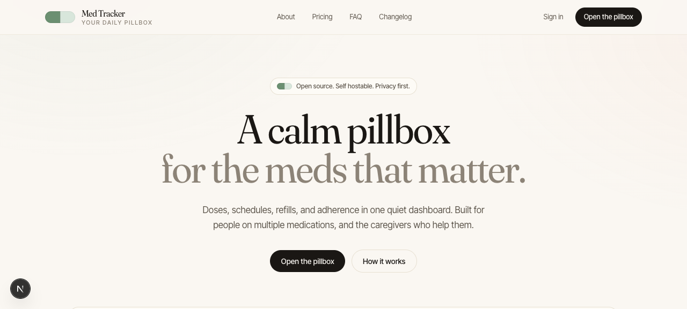

# Med-Tracker



Med-Tracker is an open source medication adherence platform. It helps patients remember doses, tracks adherence streaks, warns about drug interactions, and gives caregivers a read only window into a loved one's regimen.

The repo is a pnpm + Turborepo monorepo with a Next.js web app, a Fastify API, an Expo mobile shell, a shared component library, a Prisma data layer, and a seeded drug database with over 500 entries.

## What is in the box

- `apps/web` Next.js 15 App Router PWA with offline reminders and dark mode
- `apps/api` Fastify 4 + Prisma server, SQLite for local dev, Postgres for prod
- `apps/mobile` Expo Router shell with the same design tokens as the web app
- `packages/ui` 100+ accessible React components, tested and documented
- `packages/db` Prisma schema, migrations, and seed scripts
- `packages/types` Zod schemas shared by client and server
- `packages/icons` Duotone SVG icon set in the Phosphor style
- `packages/utils`, `packages/config` shared helpers and tooling presets
- `content/drugs` 500+ JSON files, one per medication
- `docs/` architecture, ADRs, API reference, user guide

## Features

- Medication CRUD with daily, weekly, and cron style schedules
- Reminder engine backed by service worker notifications
- Adherence log with streaks and a rolling weekly chart
- Drug interaction warnings from the seeded database
- Caregiver share view via a signed read only token
- Refill reminders driven by current supply and dose rate
- CSV and PDF export of adherence history
- Dark and light themes, system aware
- i18n scaffolding for English, Spanish, Hindi, and French

## Quickstart

```bash
pnpm install
pnpm db:migrate
pnpm db:seed
pnpm dev
```

Web is at http://localhost:3000, API is at http://localhost:4000.

## Screenshots

Screenshots live in `docs/screenshots/` once the UI work lands.

## License

MIT. See [LICENSE](LICENSE).
